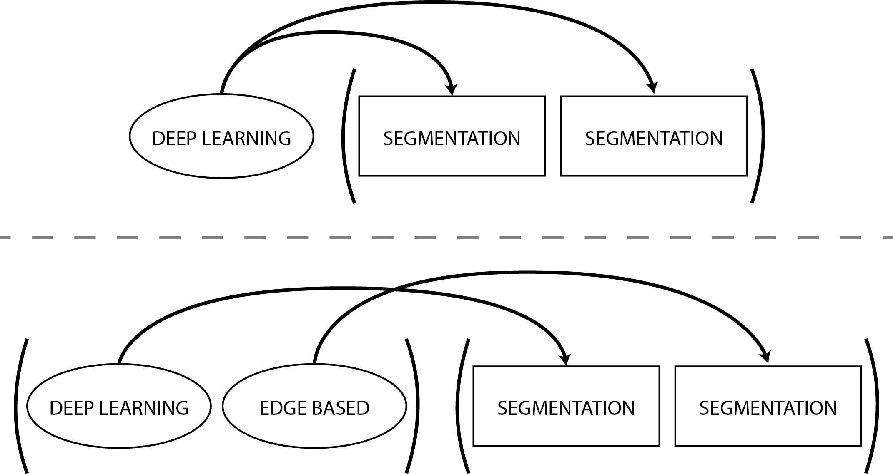

# Building Blocks

A building block represents a single atomic task, such as : segment the first channel of those images, straighten the second channel of those images using this set of masks, etc.
To be efficiently implemented, all workflows need to be divided into single building blocks.

- **segmentation** : "segmentation" building block
- **straightening** : "straightening" building block
- **morphology computation** : "morphology_computation" building block
- **quality_control** : "classification" building block
- **molt detection** : "molt_detection" building block
- **fluorescence quantification** : "fluorescence_quantification" building block
- **custom script** : "custom" building block (allowing you to run a foreign script as part of a pipeline)

More may be added in the future and others might be merged together as to facilitate the creation of more complex and personalized pipelines.

## Configuration


Configurations of all the building blocks are centralized in a big YAML configuration file. YAML is a human readable data serialization language (you can easily read it, a computer can to). Each configuration option is a list. By default those lists only contain 1 element (either an int, a string or another list). To reduce the size and redundency of the configurations, everything can be written in a factorized manner. If you have multiple building blocks of the same type in your analysis workflow, configuration options with **only one element** will be the same for all the building block of this type. For example : you have two segmentation blocks, the segmentation method is set to:


```yaml
building_blocks:
    - segmentation
    - segmentation
segmentation_method: ["deep_learning"]
```

Both your blocks will thus use deep learning to perform their segmentation. Single element options get distributed among the blocks just like a multiplication would be.

By specifying as many options as you have of a building block of a same type, the blocks will use the different options in order. In our last example, if the segmentation method was set to:

```yaml
building_blocks:
    - segmentation
    - segmentation
segmentation_method: ["deep_learning", "edge_based"]
```

The first segmentation block would use deep learning and the second one would use Sobel segmentation.

Here is a small graphical explanation.



If you ever want to leave an option empty, use the keyword **null**.

## Output

Some blocks (i.e. segmentation and straightening) will output individual images, while some others (i.e. morphology computation) will output a report file (either CSV or Parquet). The naming of those output
is always predicatable, allowing you to reliably feed the output of one block into the next one. For example, if you segment the first channel of the raw images, the corresponding output directory would be : analysis/ch1_seg. More explanation will be given in each invididual block's page.
