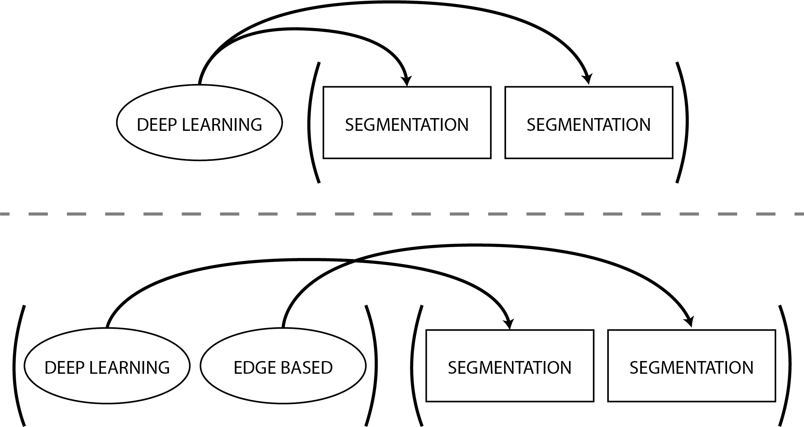

# Building Blocks

A building block represents a single atomic task, such as: segment the first
channel of those images, straighten the second channel of those images using this
set of masks, etc. To be efficiently implemented, all workflows need to be divided
into single building blocks.

- [segmentation](https://spsalmon.github.io/towbintools_pipeline/building-blocks/segmentation/) : `"segmentation"` building block
- [straightening](https://spsalmon.github.io/towbintools_pipeline/building-blocks/straightening/) : `"straightening"` building block
- [morphology computation](https://spsalmon.github.io/towbintools_pipeline/building-blocks/morphologycomputation/) : `"morphology_computation"` building block
- [quality control](https://spsalmon.github.io/towbintools_pipeline/building-blocks/qualitycontrol/) : `"quality_control"` building block
- [fluorescence quantification](https://spsalmon.github.io/towbintools_pipeline/building-blocks/fluorescencequantification/) : `"fluorescence_quantification"` building block
- [molt detection](https://spsalmon.github.io/towbintools_pipeline/building-blocks/moltdetection/) : `"molt_detection"` building block
- [custom script](https://spsalmon.github.io/towbintools_pipeline/building-blocks/custom/) : `"custom"` building block (allowing you to run a foreign script as part of a pipeline)

More may be added in the future and others might be merged together, as to
facilitate the creation of more complex and personalized pipelines.

```{note}
The `"classification"` block was renamed to `"quality_control"`. Old
configurations using the former name are rejected with a message telling you what
to change.
```

## Configuration

The configurations of all the building blocks are centralized in a single YAML
configuration file (see [configuration](https://spsalmon.github.io/towbintools_pipeline/usage/configuration/)
for the general options). Each configuration option is a list. By default those
lists only contain 1 element (either an int, a string or another list).

To reduce the size and redundancy of the configurations, everything can be written
in a factorized manner. If you have multiple building blocks of the same type in
your analysis workflow, configuration options with **only one element** will be
the same for all the building blocks of this type. For example: you have two
segmentation blocks, and the segmentation method is set to:

```yaml
building_blocks:
    - segmentation
    - segmentation
segmentation_method: ["deep_learning"]
```

Both your blocks will thus use deep learning to perform their segmentation.
Single element options get distributed among the blocks just like a multiplication
would be.

By specifying as many options as you have building blocks of the same type, the
blocks will use the different options in order. In our last example, if the
segmentation method was set to:

```yaml
building_blocks:
    - segmentation
    - segmentation
segmentation_method: ["deep_learning", "edge_based"]
```

The first segmentation block would use deep learning and the second one would use
Sobel segmentation.

Here is a small graphical explanation.



Any other number of elements is an error, and is reported before the run starts.
If you ever want to leave an option empty, use the keyword **null**.

## Referring to the output of another block

Many options point at a folder produced by an earlier block: the masks used for
straightening, the images used for quality control, and so on. These are written
**by name**, without the analysis directory prefix:

```yaml
straightening_masks: [ "ch2_seg" ]
```

`ch2_seg` and `analysis/ch2_seg` are equivalent, so older configurations keep
working, but the short form is preferred: it stays correct if you rename your
analysis directory. `raw` always means the raw images, and an absolute path is
used exactly as written.

## Output

Some blocks (i.e. segmentation and straightening) output individual images, while
others (i.e. morphology computation) output a report file (either CSV or Parquet).
The naming of those outputs is always predictable, allowing you to reliably feed
the output of one block into the next one. For example, if you segment the first
channel of the raw images, the corresponding output directory will be
`analysis/ch1_seg`, and you refer to it as `ch1_seg`.

After the output (directory or report file) is generated, its content is added to
the analysis filemap, resulting in new columns. In general, all columns
corresponding to file paths of new images (segmentation masks, etc.) start with
the name of your analysis directory (e.g. `analysis`). See each block's page to
learn how its output will look like.
